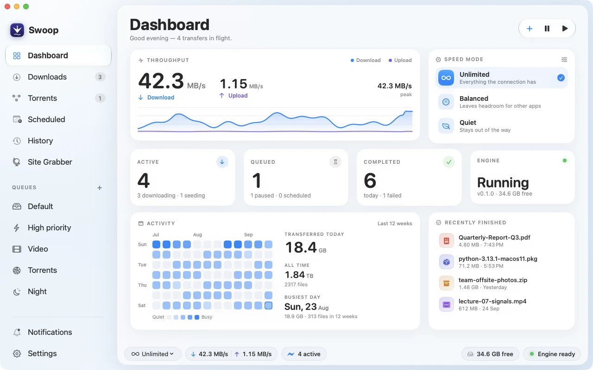

<p align="center">
  
</p>

<h1 align="center">Swoop</h1>

<p align="center">
  A fast, native download manager for macOS.
</p>

<p align="center">
  <a href="https://github.com/Saijayaranjan/Swoop/releases/latest">Download</a>
  &nbsp;·&nbsp;
  <a href="https://saijayaranjan.github.io/Swoop/">Website</a>
  &nbsp;·&nbsp;
  <a href="docs">Documentation</a>
  &nbsp;·&nbsp;
  <a href="docs/cli.md">CLI</a>
</p>

<br>

<p align="center">
  <picture>
    <source media="(prefers-color-scheme: dark)" srcset="website/assets/screens/dashboard-dark.webp">
    
  </picture>
</p>

<br>

Swoop pairs an interface built natively for the Mac with a Rust engine that does the heavy lifting. It splits files into adaptive segments, handles torrents and streams, runs on schedules, and can be driven from a browser, a terminal or another device. There are no accounts and no telemetry.

## Highlights

**Adaptive acceleration.** Every file is split into segments that steal work from one another. Swoop adds a connection only when it measurably helps, backs off the moment a server pushes back, and splits slow tails so the last few percent never crawl.

**Every common source.** HTTP and HTTPS with resume and mirrors, FTP and FTPS, BitTorrent and magnet links, Metalink, and HLS streams without DRM.

**Queues and schedules.** Queues with their own folders, concurrency and order. Download windows for nights and weekends, optionally only on power or unmetered networks.

**Rules and automation.** Rules sort each download into the right category, folder and queue. Finished files can be moved, tagged in Finder or announced to a webhook.

**Browser capture.** An extension for Chrome, Edge, Brave and Firefox hands downloads to Swoop with the cookies and referrer the site expects, and finds media on the page.

**Remote and headless.** Pair a phone or another computer with a one-time code, or run the same engine without the app on a Linux box, a NAS or in Docker.

**Built to recover.** Progress is checkpointed only after data is safely on disk. After a crash or restart, Swoop checks every download against what is on disk and continues where it stopped.

**Private by design.** Swoop talks to the sites you download from and the devices you pair, nothing else. Credentials live in the macOS Keychain.

## Install

Download the latest `Swoop-x.y.z.dmg` from [Releases](https://github.com/Saijayaranjan/Swoop/releases/latest) and drag Swoop to Applications. Swoop is a universal app for Apple silicon and Intel and requires macOS 14 Sonoma or later.

Releases are not yet notarized, so macOS asks for confirmation the first time. Control-click Swoop in Applications and choose **Open**, or run:

```bash
xattr -dr com.apple.quarantine /Applications/Swoop.app
```

Swoop keeps itself up to date from this repository's releases. Each update is verified against an Ed25519 signature, its bundle identity and its code signature before it replaces the installed app.

### Browser extension

The extension is not in the browser stores yet. Build it and load it unpacked:

```bash
cd extensions/browser && npm ci && npm run build
```

Then open your browser's extensions page, enable developer mode and load `extensions/browser/dist/chrome`, or `dist/firefox` in Firefox. Open Swoop once and the extension connects on its own.

## Headless

The engine behind the app also runs on its own, with the same API, CLI and remote web app.

```bash
swoop server --download-dir ~/Downloads     # run the engine
swoop add https://example.com/file.iso      # queue a download
swoop list                                  # see what is running
swoop pair                                  # pair a phone or another computer
```

With Docker:

```bash
docker compose -f docker/compose.yaml up -d --build
```

The full command reference is in [docs/cli.md](docs/cli.md).

## Build from source

Requirements: macOS 14 or later, Xcode or the Command Line Tools with the macOS 26 SDK or newer, Rust stable via [rustup](https://rustup.rs), and Node.js 20 or later.

```bash
git clone https://github.com/Saijayaranjan/Swoop.git
cd Swoop

(cd web/remote && npm ci && npm run build)   # the remote web app is embedded in the engine
scripts/build-macos.sh --release             # add --universal --dmg for a release build
open build/Swoop.app
```

Run the tests:

```bash
cargo test --workspace
cargo clippy --workspace --all-targets -- -D warnings
(cd apps/macos && swift test)
(cd extensions/browser && npm test)
```

## Architecture

The app embeds the engine in-process through UniFFI. The same engine runs headless behind `swoop server`, and every client, from the app to the CLI, the extension and the remote web app, speaks one API.

```
apps/macos             SwiftUI and AppKit app
crates/
  swoop-domain         types, task state machine, events
  swoop-runtime        rate limiting, disk I/O, path safety, redaction
  swoop-store          SQLite persistence and crash recovery
  swoop-engine-http    segmented HTTP and HTTPS, mirrors, Metalink
  swoop-engine-ftp     FTP and FTPS
  swoop-engine-torrent BitTorrent and magnet links
  swoop-media          HLS
  swoop-services       the engine facade every client uses
  swoop-server         REST and WebSocket API, pairing, remote web app
  swoop-cli            the swoop command, headless server, browser bridge
  swoop-ffi            the bridge into the macOS app
  swoop-update         signed, verified updates
extensions/browser     Chrome, Edge, Brave and Firefox extension
web/remote             remote web app
website                product site
```

Design decisions are recorded in [docs/architecture](docs/architecture), and the current state of every feature is tracked in [docs/STATUS.md](docs/STATUS.md).

## Security

Swoop treats every server, file name, torrent and playlist as untrusted. Writes are confined to the folders you choose, redirects cannot reach private networks, remote access is off until you enable it and then requires TLS and scoped device tokens, and automations that run code need consent given in the app. The details are in the [security model](docs/security/security-model.md) and [threat model](docs/security/threat-model.md).

To report a vulnerability, please open a private [security advisory](https://github.com/Saijayaranjan/Swoop/security/advisories/new) rather than a public issue.

## Contributing

Issues and pull requests are welcome. Read [CONTRIBUTING.md](CONTRIBUTING.md) for the toolchain, the engineering rules and how the code is organised.

## License

Swoop is available under either the [MIT License](LICENSE-MIT) or the [Apache License 2.0](LICENSE-APACHE), at your option.
